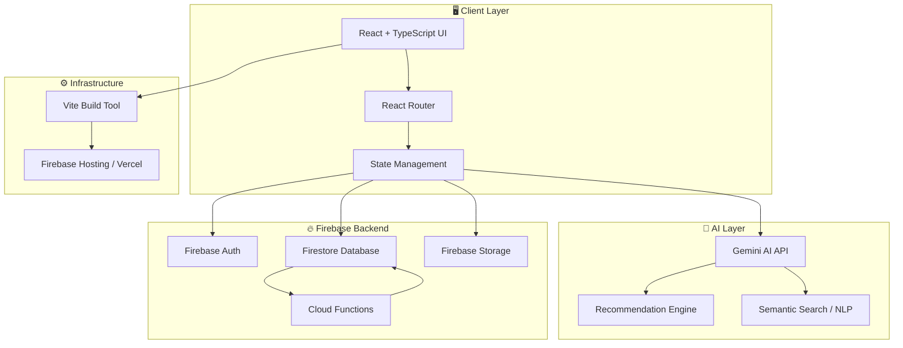
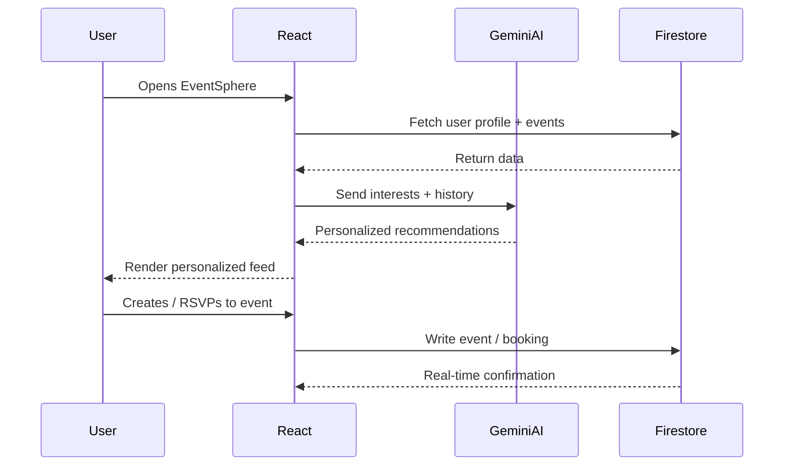

<div align="center">


# 🌐 EventSphere

### *Discover. Create. Experience. Powered by AI.*

[](https://www.typescriptlang.org/)
[](https://react.dev/)
[](https://vitejs.dev/)
[](https://firebase.google.com/)
[](https://ai.google.dev/)
[](LICENSE)
[]()
[](CONTRIBUTING.md)

<br/>

**EventSphere** is a next-generation, AI-powered event management and discovery platform. From local meetups to large-scale conferences — discover events you'll love, host events that matter, and manage everything in one intelligent workspace.

<br/>

[🚀 Live Demo](https://ai.studio/apps/09049171-411a-4377-99c5-3654b471657e) · [📖 Docs](#-installation) · [🐛 Report Bug](https://github.com/pandeylakshya207-max/EventSphere/issues) · [✨ Request Feature](https://github.com/pandeylakshya207-max/EventSphere/issues)

</div>

---

## 📌 Table of Contents

- [Overview](#-overview)
- [Why EventSphere?](#-why-eventsphere)
- [Problem Statement](#-problem-statement)
- [Solution](#-solution)
- [Key Features](#-key-features)
- [AI-Powered Capabilities](#-ai-powered-capabilities)
- [Architecture Overview](#-architecture-overview)
- [Tech Stack](#-tech-stack)
- [Folder Structure](#-folder-structure)
- [Installation](#-installation)
- [Environment Variables](#-environment-variables)
- [Firebase Setup](#-firebase-setup)
- [Deployment](#-deployment)
- [Screenshots](#-screenshots)
- [Scalability & Performance](#-scalability--performance)
- [Roadmap](#-roadmap)
- [Security](#-security)
- [Contributing](#-contributing)
- [License](#-license)
- [Acknowledgements](#-acknowledgements)

---

## 🔭 Overview

EventSphere is a full-stack, AI-augmented event platform that reimagines how people discover and manage events. Built with a modern React + TypeScript frontend, Firebase backend, and Gemini AI integration, it delivers a seamless experience for attendees and organizers alike.

Whether you're planning a 10-person workshop or a 10,000-person conference, EventSphere gives you the tools — and the intelligence — to make it exceptional.

---

## 💡 Why EventSphere?

| Feature | EventSphere | Traditional Platforms |
|---|---|---|
| AI-powered recommendations | ✅ Gemini AI | ❌ Basic filters only |
| Real-time updates | ✅ Firestore live sync | ⚠️ Polling-based |
| Personalized event feed | ✅ Dynamic profiles | ❌ Static listings |
| Modern, responsive UI | ✅ React + Vite | ⚠️ Often outdated |
| Instant event creation | ✅ Streamlined wizard | ❌ Complex multi-step forms |
| Open-source & extensible | ✅ MIT Licensed | ❌ Closed, costly |

---

## 🧩 Problem Statement

The current event ecosystem is broken in three key ways:

1. **Discovery is dumb** — keyword searches and category filters don't surface the right events for the right people.
2. **Hosting is painful** — creating and managing events involves juggling multiple platforms, tools, and communication channels.
3. **Engagement is lost** — attendees have no personalized experience before, during, or after an event.

---

## ✅ Solution

EventSphere unifies event discovery, creation, and management into a single intelligent platform:

- 🤖 **AI-driven recommendations** surface events tailored to each user's interests and history
- 🏗️ **Streamlined event creation** with guided setup and intelligent field suggestions
- 📊 **Organizer dashboards** for real-time attendee tracking and engagement analytics
- 🔔 **Smart notifications** and reminders powered by Firestore triggers
- 🌍 **Scalable cloud infrastructure** via Firebase that grows with your audience

---

## ✨ Key Features

### For Attendees
- 🔍 **Smart Event Discovery** — personalized feed based on interests and location
- 🎟️ **One-click Registration** — frictionless RSVP and ticket booking
- 🔔 **Smart Reminders** — AI-timed notifications so you never miss an event
- 📅 **Personal Calendar Sync** — integrate events into your existing schedule
- ⭐ **Reviews & Ratings** — community-driven event feedback

### For Organizers
- 🚀 **Instant Event Creation** — publish an event in under 2 minutes
- 📊 **Real-time Dashboard** — live attendee counts, check-ins, and engagement metrics
- 📣 **Promotion Tools** — shareable event pages and built-in social sharing
- 💬 **Attendee Messaging** — broadcast updates directly to registered attendees
- 📈 **Analytics & Insights** — post-event reports and engagement breakdowns

---

## 🤖 AI-Powered Capabilities

Powered by **Google Gemini AI**, EventSphere brings intelligence to every layer:

| Capability | Description |
|---|---|
| 🧠 Smart Recommendations | Personalized event suggestions based on user behavior, location, and preferences |
| ✍️ AI Event Descriptions | Auto-generate compelling event descriptions from a few bullet points |
| 🔎 Semantic Search | Natural language event search ("tech meetups this weekend near me") |
| 💡 Planning Assistant | AI-guided event setup: suggests capacity, pricing, timing, and category |
| 📊 Sentiment Analysis | Analyze attendee reviews to surface actionable organizer insights |
| 🗓️ Scheduling Intelligence | Recommend optimal event times based on audience availability signals |

---

## 🏗️ Architecture Overview



### Data Flow



---

## 🛠️ Tech Stack

| Layer | Technology | Purpose |
|---|---|---|
| Frontend | React 18 + TypeScript | UI and component logic |
| Build Tool | Vite | Fast dev server and bundling |
| Styling | Tailwind CSS / shadcn/ui | Responsive, modern UI |
| Database | Firestore (NoSQL) | Real-time event and user data |
| Auth | Firebase Auth | Secure user authentication |
| File Storage | Firebase Storage | Event images and media |
| AI | Google Gemini API | Recommendations, search, content |
| Backend Logic | Firebase Cloud Functions | Server-side triggers and processing |
| Hosting | Firebase Hosting | Fast global CDN delivery |

---

## 📁 Folder Structure

```
EventSphere/
├── src/
│   ├── components/          # Reusable UI components
│   │   └── ui/              # Base design system components
│   ├── pages/               # Route-level page components
│   ├── hooks/               # Custom React hooks
│   ├── services/            # Firebase & Gemini API service layers
│   ├── store/               # Global state management
│   ├── types/               # TypeScript interfaces and types
│   └── utils/               # Helper utilities
├── public/                  # Static assets
├── firebase-applet-config.json   # Firebase app config
├── firebase-blueprint.json       # Firebase project structure
├── firestore.rules              # Firestore security rules
├── .env.example                 # Environment variable template
├── vite.config.ts               # Vite configuration
├── tsconfig.json                # TypeScript configuration
├── package.json
└── README.md
```

---

## 🚀 Installation

### Prerequisites

- Node.js `>=18.0.0`
- npm or yarn
- Firebase account
- Google Gemini API key

### 1. Clone the Repository

```bash
git clone https://github.com/pandeylakshya207-max/EventSphere.git
cd EventSphere
```

### 2. Install Dependencies

```bash
npm install
```

### 3. Configure Environment Variables

```bash
cp .env.example .env.local
```

Fill in the values — see [Environment Variables](#-environment-variables) below.

### 4. Start Development Server

```bash
npm run dev
```

Open [http://localhost:5173](http://localhost:5173) in your browser.

---

## 🔑 Environment Variables

Create a `.env.local` file in the root directory with the following:

```env
# Google Gemini AI
VITE_GEMINI_API_KEY=your_gemini_api_key_here

# Firebase Configuration
VITE_FIREBASE_API_KEY=your_firebase_api_key
VITE_FIREBASE_AUTH_DOMAIN=your_project.firebaseapp.com
VITE_FIREBASE_PROJECT_ID=your_project_id
VITE_FIREBASE_STORAGE_BUCKET=your_project.appspot.com
VITE_FIREBASE_MESSAGING_SENDER_ID=your_sender_id
VITE_FIREBASE_APP_ID=your_app_id
```

> ⚠️ **Never commit `.env.local` to version control.** It is already listed in `.gitignore`.

---

## 🔥 Firebase Setup

1. Go to [Firebase Console](https://console.firebase.google.com/) and create a new project.
2. Enable the following services:
   - **Authentication** → Email/Password + Google Sign-in
   - **Firestore Database** → Start in production mode
   - **Storage** → Default bucket
3. Copy your Firebase config object into `.env.local`.
4. Deploy Firestore security rules:

```bash
npm install -g firebase-tools
firebase login
firebase deploy --only firestore:rules
```

---

## 🌐 Deployment

### Firebase Hosting (Recommended)

```bash
npm run build
firebase deploy --only hosting
```

### Vercel

```bash
npm install -g vercel
vercel --prod
```

Set all `VITE_*` environment variables in your Vercel project dashboard under **Settings → Environment Variables**.

---

## 📸 Screenshots

> 🖼️ Screenshots coming soon. [Contribute one!](CONTRIBUTING.md)

| View | Preview |
|---|---|
| 🏠 Home / Event Feed | *(screenshot placeholder)* |
| 🔍 Event Discovery | *(screenshot placeholder)* |
| 📋 Event Detail Page | *(screenshot placeholder)* |
| 🎛️ Organizer Dashboard | *(screenshot placeholder)* |
| 🤖 AI Recommendations | *(screenshot placeholder)* |

---

## ⚡ Scalability & Performance

EventSphere is architected for production-grade scale from day one:

- **Firestore's NoSQL model** enables horizontal scaling with no schema migrations
- **Vite's ESM-first build** delivers sub-second HMR in dev and optimized chunks in production
- **Firebase CDN + Hosting** serves static assets globally with sub-100ms TTFB
- **Cloud Functions** offload heavy AI processing server-side, keeping the client fast
- **Gemini API caching** strategies reduce redundant AI calls and control cost at scale
- **Code splitting** via React lazy + Suspense ensures only required bundles are loaded per route

---

## 🗺️ Roadmap

### Phase 1 — Foundation ✅
- [x] Project architecture and Firebase integration
- [x] User authentication (Email + Google)
- [x] Event creation and listing
- [x] Gemini AI integration scaffold
- [x] Responsive UI with component library

### Phase 2 — Intelligence 🚧
- [ ] Full AI recommendation engine
- [ ] Semantic search with Gemini embeddings
- [ ] AI-assisted event description generation
- [ ] Personalized user interest profiles
- [ ] Attendee engagement notifications

### Phase 3 — Growth 📅
- [ ] Ticketing and payment integration (Stripe)
- [ ] Calendar sync (Google Calendar, iCal)
- [ ] Mobile app (React Native)
- [ ] Multi-organizer team management
- [ ] Advanced analytics dashboard

### Phase 4 — Scale 🔮
- [ ] White-label organizer portals
- [ ] Enterprise API for B2B integrations
- [ ] Hybrid / virtual event support
- [ ] Multi-language and multi-region support
- [ ] Event sponsorship marketplace

---

## 🔒 Security

- **Firestore Security Rules** enforce per-user data access — no client-side data leaks
- **Firebase Auth** manages session tokens securely with short-lived JWTs
- **Environment variables** are scoped to `VITE_` prefix and never exposed server-side
- **API keys** are restricted via Google Cloud Console (domain and IP allowlists)
- All dependencies are audited via `npm audit` in CI

> Found a vulnerability? Please [open a private security advisory](https://github.com/pandeylakshya207-max/EventSphere/security/advisories/new) instead of a public issue.

---

## 🤝 Contributing

Contributions are what make open source thrive. Any contribution you make is **greatly appreciated**.

1. **Fork** the repository
2. **Create** your feature branch: `git checkout -b feature/AmazingFeature`
3. **Commit** your changes: `git commit -m 'feat: add AmazingFeature'`
4. **Push** to the branch: `git push origin feature/AmazingFeature`
5. **Open** a Pull Request

Please read our [Contributing Guidelines](CONTRIBUTING.md) and follow the [Code of Conduct](CODE_OF_CONDUCT.md).

### Good First Issues

Look for issues tagged [`good first issue`](https://github.com/pandeylakshya207-max/EventSphere/issues?q=label%3A%22good+first+issue%22) to get started.

---

## 📄 License

Distributed under the MIT License. See [`LICENSE`](LICENSE) for more information.

---

## 🙏 Acknowledgements

- [Google Gemini AI](https://ai.google.dev/) — for powering the intelligence layer
- [Firebase](https://firebase.google.com/) — for the real-time backend infrastructure
- [Vite](https://vitejs.dev/) — for the blazing fast dev experience
- [shadcn/ui](https://ui.shadcn.com/) — for the beautiful component primitives
- [Google AI Studio](https://ai.studio/) — for rapid prototyping and deployment

---

<div align="center">

**Built with ❤️ by [Lakshya Pandey](https://github.com/pandeylakshya207-max)**

⭐ Star this repo if EventSphere inspires you — it helps more than you know.

</div>
